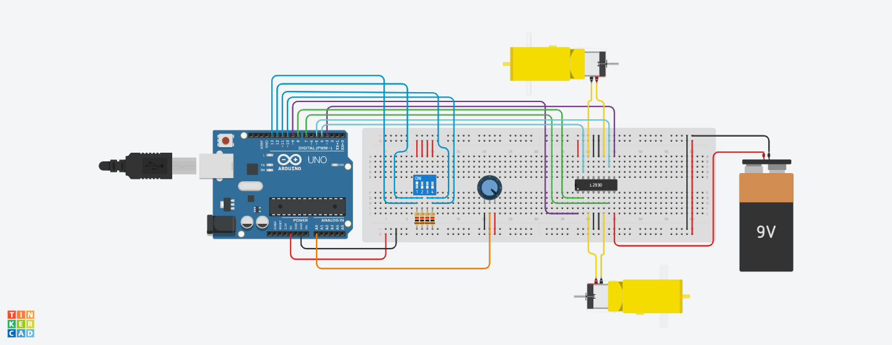

# R3-SoftwareTraining-1
 


TinkerCAD Link: https://www.tinkercad.com/things/kjybjciv3L4

For this project I was tasked with using a DIP switch and a potentiometer to control 2 motors. The DIP switch is used to control the direction of the motors and the potentiometer is used to control the speed. Below are some important parts of the project which I will explain in greater detail.

- The L293D Motor Driver IC

This integrated circuit allows for both motors to be controlled and powered safely using the Arduino. Most motors require a lot of current to be drawn in order to run, which cannot be safely provided through the Arduino alone. In addition, the IC contains an H-Bridge circuit which utilizes 4 switches to control the direction of rotation for the motors. Pin 8 on the L293D allows for an optional secondary power source to allow the motors to run faster. In this project a 9V battery was used.  

- The DIP Switch

The DIP (or dual in-line package) switch is a component containing multiple switches on a single board. For this project a DIP switch with 4 switches was used; one for each motor direction. When setting the switches in the setup function, *INPUT_PULLUP* was used rather than the usual *INPUT* as shown below.

```
pinMode(switch1, INPUT_PULLUP);
```
This makes use of internal resistors in the Arduino to ensure the pins connected to the switch are not in a floating state. Four 1 kiloohm resistors are also in the circuit, going from the switch to ground. To check the state of each switch, state variables were created. These variables are checked in the following if/else statements to determine which direction to rotate the motors. 
```
if (state1 == HIGH) {
    forward();
  }
  else if (state2 == HIGH) {
    backward();
  }
  else if (state3 == HIGH) {
    left();
  }
  else if (state4 == HIGH) {
    right();
  }
  else {
    stop();
  }
  ```
  *stop()* is set as the default mode, so when none of the switches are pressed, the motors will be off. 

  Each direction function sets each switch in the H-bridge circuit to either high or low to produce the desired direction. For example, the *forward()* function is shown below.
  ```
  void forward() { 
  analogWrite(speed1, speed);
  analogWrite(speed2, speed);
  digitalWrite(motor1, HIGH);
  digitalWrite(motor2, LOW);
  digitalWrite(motor3, HIGH);
  digitalWrite(motor4, LOW);
}
```
The first two lines control the speed and will be discussed later. Each *motor* variable controls a switch on the H-Bridge circuit in the L293D. The first 2 are on the left side of the IC and the other 2 are on the right side of it.

- The Potentiometer

The potentiometer allows for the speed of the motors to be changed. The value of the potentiometer is read and then mapped from 0 to 1023 to 0 to 255, as these values are within the range accepted by the IC. 
```
int potValue = analogRead(A0);
  speed = map(potValue, 0, 1023, 0, 255);
```

This speed value is used in each direction function as shown above. 

This concludes the writeup about the project, overall very fun to work on. 